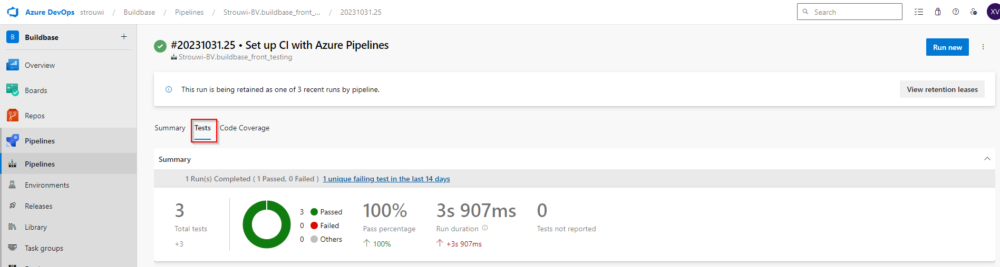
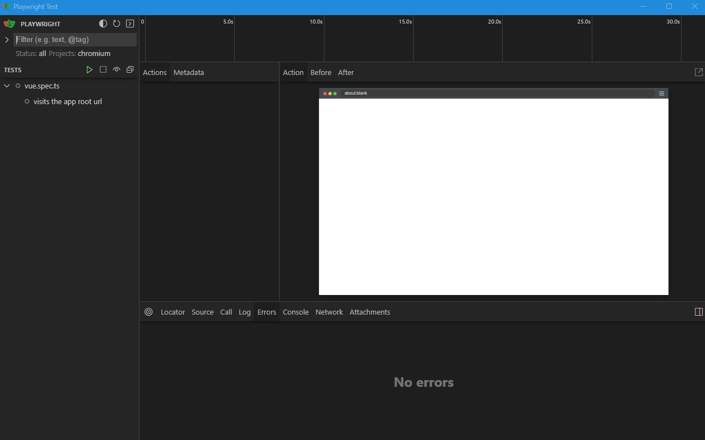
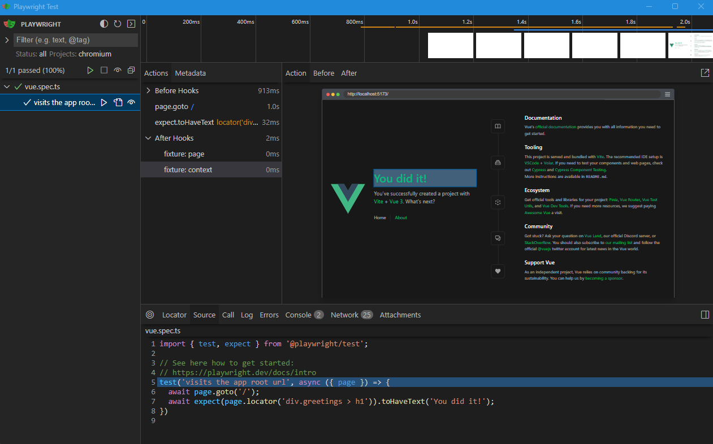
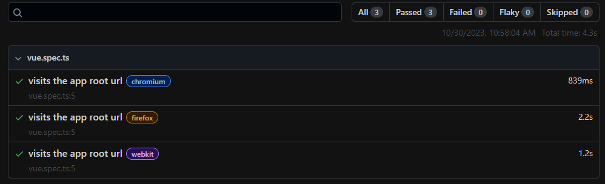

![playwright] ![typescript] ![azure-devops]

<br />
<div align="center">
  <a href="https://strouwi.be/">
    
  </a>

<h3 align="center">Buildbase front testing</h3>

  <p align="center">
    Project containing integration, end-to-end testing for buildbase
    <br />
  </p>
</div>

# Project setup

It's a typescript project executing integration, end-to-end testing using the [Playwright](https://playwright.dev/) framework. 


The pipeline will trigger 
- whenever changes are made on the dev branch
- every day at 12:00 and 20:00

The project will be build and Playwright will execute the tests. The tests are then published and can be found under the "Tests" section of the Azure job.


See :clipboard: ef

For each job, a message will be send in the "playwright-results" channel on Slack.

# How to use playwright
## Install
```
npx playwright install
```

## Run
Without UI
```
npx playwright test
```
With UI
```
npx playwright test --ui
```


From the UI, ou can run the tests with the play buttons and inspect them.  
At the top of the window, there is a timeline. At the bottom, you can see more information about the selected test.

## Report
```
npx playwright show-report
```

Each test is run on multiple browsers, here you have an overview of their results.

## How to write tests
https://playwright.dev/docs/writing-tests

<!-- MARKDOWN LINKS & IMAGES -->
<!-- https://www.markdownguide.org/basic-syntax/#reference-style-links -->

[playwright]: https://img.shields.io/badge/Playwright-45ba4b?style=for-the-badge&logo=Playwright&logoColor=whit

[typescript]: https://img.shields.io/badge/TypeScript-007ACC?style=for-the-badge&logo=typescript&logoColor=white

[azure-devops]: https://img.shields.io/badge/Azure_DevOps-0078D7?style=for-the-badge&logo=azure-devops&logoColor=white